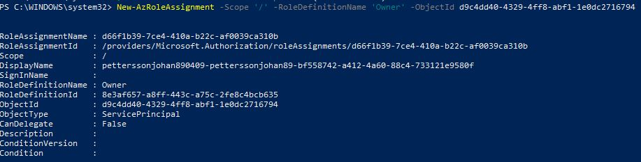

# Bicep - Proof of Concept

## Presumptions
At target Subscription in Azure, we expect that a resource group named dmsResourceGroup exists.
That is because subnet for device context should be deployed to an pre existing resource group 
at azure.

## Main


## Errors
Client that is deploying (from Azure Devops) need to have owner at root scope '/'. Wasn't needed from github though
However from github actions a login is done beforehand with secrets.AZURE_SPN_CREDENTIAL
```
ERROR: {"code": "AuthorizationFailed", "message": "The client 'd9c4dd40-4329-4ff8-abf1-1e0dc2716794' with object id 'd9c4dd40-4329-4ff8-abf1-1e0dc2716794' does not have authorization to perform action 'Microsoft.Resources/deployments/validate/action' over scope '/subscriptions/bf558742-a412-4a60-88c4-733121e9580f' or the scope is invalid. If access was recently granted, please refresh your credentials."}
```
[info(https://github.com/Azure/Enterprise-Scale/blob/main/docs/EnterpriseScale-Setup-azure.md)]
